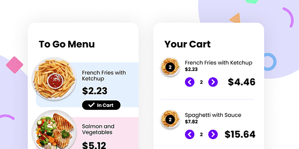

# Brief

In this project, we're creating an eCommerce component.

You can use as many (or as few) tools, libraries, and frameworks as you'd like. If you're trying to learn something new, this would be a great way to push yourself.

**Users should be able to:**

- View the plates on the left side of the screen and add them to your cart on the right side.
- When there are no plates within your cart, you should see a message that says, "Your cart is empty."
- When a plate is added to your cart, the Subtotal and Totals will automatically update.
- When products are in your cart, you should be able to increase and decrease the quantity.
  - A user should not be able to mark the quantity as a negative number.
  - If the quantity goes down to 0, the user will have the option to delete or remove the product for their cart entirely.
- Tax is based on the state of Tennessee sales tax: `0.0975`

# Getting Started

1. To get started, [download the files](https://drive.google.com/drive/folders/181MXzvw_Pli5d-ICdOC41lAfTPXBRM3y?usp=sharing). This includes all the project assets you need to get started: a creative brief, a Figma file with the designs, fonts, and images.
2. Take a look around. Look at the project's Figma file. If you don't have a Figma account, don't worry, [you can set one up for free.](http://figma.com)
3. Open the project's `README.md` file (that's this!). It has additional information on how the project is structured.
4. Customize your project / file architecture to your liking.
5. Happy coding!
6. Once you're finished, share your work in classroom

# Taking your Project to the Next Level

- Use a framework or library like [Tailwind CSS](https://tailwindcss.com/), [Styled Components](https://styled-components.com/), or [CSS Modules](https://github.com/css-modules/css-modules). Or, if you're feeling particularly adventurous, try writing everything in Vanilla CSS.

# FAQs

- Can I use libraries / frameworks on these projects?
  - Of course! We're providing the design files, but you can use whatever tools and frameworks you'd like.
- Can I use this project in my portfolio?
  - Sure! But, be honest about the work that _you_ did
