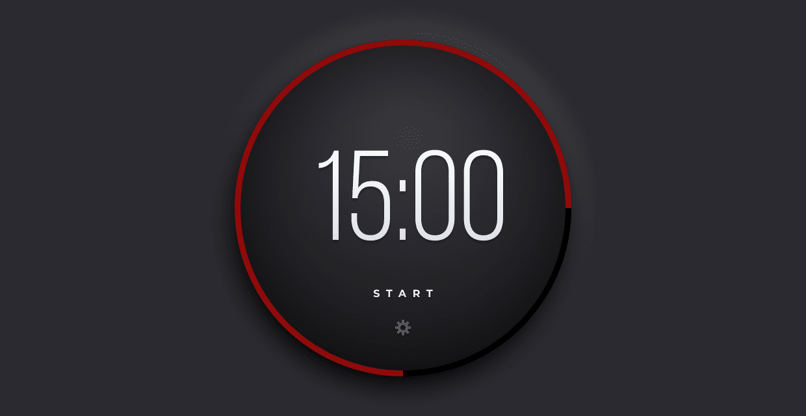

# Brief

In this project, we're creating a Pomodoro timer.

You can use as many (or as few) tools, libraries, and frameworks as you'd like. If you're trying to learn something new, this might be a great way to push yourself.

**Users should be able to:**

- Start the timer by clicking on the start link/button.
- Once the user clicks start, the word start will change to stop. Then, the user can click on the stop button to make the timer stop.
- Click on the gear icon to change the length (minutes and seconds) of the timer.
- Once the timer finishes, the ring should change from green to red and an alert message is passed to the browser.

# Getting Started

1. To get started, [download the zip file](https://drive.google.com/drive/folders/1ZwnRTG0A1n5EOgi6HmHDkrFde4yxkhsH?ck_subscriber_id=1527215155). This includes all the project assets you need to get started: HTML, CSS, images, and fonts.
2. Take a look around. Look at the project's Figma file. This is a great way to see how the pieces and parts should look within the browser.
3. Open the project's `README.md` file. It has additional information on how the project is structured.
4. Customize your project / file architecture to your liking.
5. Happy coding!
6. Once you're finished, share your work in classroom

# Taking your Project to the Next Level

- Use a framework like [React](https://reactjs.org/), [Vue](https://vuejs.org/), or [Svelte](https://svelte.dev/). Or, if you're feeling particularly adventurous, try writing everything in Vanilla JavaScript.
- Take a step back and try writing the HTML and CSS for this project yourself. Start with the provided Figma file.
- When the timer is completed, play the alert sound. (Audio file included)

# FAQs

- Can I use libraries / frameworks on these projects?
    - Of course! We're providing the vanilla HTML and CSS, but you can use whatever tools and frameworks you'd like.
- Can I use this project in my portfolio?
    - Sure! But, be honest about the work that *you* did
